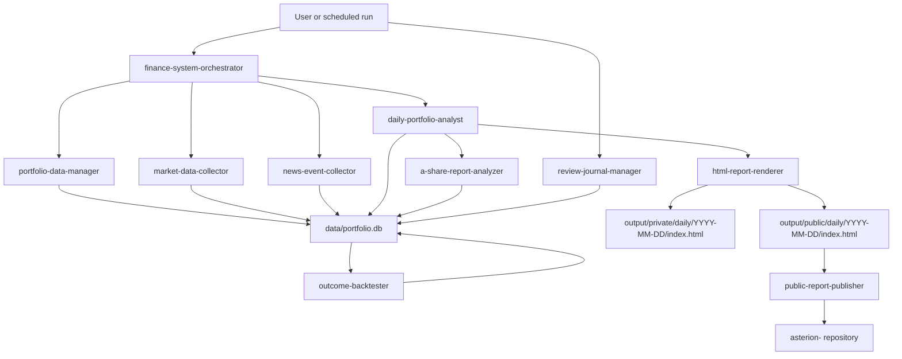

# Asterion Agent Skill System Design

## 1. Design Goal

Build a local-first stock analysis system that can be operated by Codex or any future agent after cloning the private core repository.

Core constraints:

- Agent is the runtime. Today the runtime is Codex, but the system must not depend on Codex-only memory.
- Skills are the capability contracts. Every repeatable domain workflow should live in `skills/`.
- SQLite is the private structured source of truth.
- Git stores code, schemas, templates, bootstrap files, and sample data only.
- Real portfolio data, transaction data, API keys, raw feeds, private reports, and review records must not be committed.
- Public publishing is artifact-based. A report instance repository receives only sanitized static HTML/JSON exports.

## 2. Repository Taxonomy

### Product Repositories

Asterion is split into product capability repositories and user-specific instance repositories.

| Repository | Responsibility | Contains User Data | Suggested Visibility |
|---|---|---:|---|
| `asterion-core` | Agent skills, SQLite schema, scripts, bootstrap, local runtime | No real data | Private or internal |
| `asterion-pages` | Static report templates, reusable front-end shell, styles, components | No real data | Public or private |
| `asterion-<instance>` | One concrete running instance with generated reports and optional local config | Sanitized report artifacts only if committed | Private by default; public only after sanitization |

`asterion-core` and `asterion-pages` are reusable product assets. The current running system should be treated as an `asterion-<instance>` repository, because it contains concrete report history and publication choices.

### `asterion-core`

`asterion-core` runs locally and owns the private production runtime. It stores code and instructions, but not real user data.

```text
asterion-core/
  AGENTS.md
  BOOTSTRAP.md
  bootstrap.sh
  pyproject.toml
  .env.example
  .gitignore

  db/
    schema.sql
    migrations/
    seed.example.sql

  skills/
    finance-system-orchestrator/
    portfolio-data-manager/
    market-data-collector/
    news-event-collector/
    daily-portfolio-analyst/
    a-share-report-analyzer/
    review-journal-manager/
    outcome-backtester/
    html-report-renderer/
    public-report-publisher/

  scripts/
    init_db.py
    migrate_db.py
    run_daily.py
    publish_public.py

  templates/
    daily-private.html
    daily-public.html

  data/                 # gitignored
    portfolio.db
    raw/
    cache/
    exports/

  output/               # gitignored
    private/
    public/
```

### `asterion-pages`

`asterion-pages` stores reusable static-page templates and front-end assets. It is not a report archive.

```text
asterion-pages/
  templates/
    daily-private.html
    daily-public.html
    report-index.html
  assets/
    styles.css
    app.js
  examples/
    daily/
      2099-01-01/
        index.html
    daily-reports.json
```

The examples must use fake data only. `asterion-pages` should be safe to open-source if desired.

### `asterion-<instance>`

An instance repository represents one concrete running deployment, such as the user's personal report site. It may contain generated public or masked artifacts, but it must not contain the private SQLite database or raw account data.

```text
asterion-personal/
  index.html
  assets/
  daily/
    YYYY-MM-DD/
      index.html
  daily-reports.json
```

An instance repository must never read from `portfolio.db`. It only receives pre-rendered sanitized artifacts from `asterion-core/output/public/`.

The current `Finance` workspace should be treated as an instance repository candidate: it already contains concrete equity report artifacts, a static workbench, and publication-specific report indexes. Reusable runtime logic should move into `asterion-core`; reusable page templates should move into `asterion-pages`; generated or curated report instances stay in the instance repository.

## 3. Skill Architecture

### Packaged Skills

| Skill | Role | Reads | Writes |
|---|---|---|---|
| `finance-system-orchestrator` | Main workflow router and run coordinator | User request, bootstrap docs, skill metadata | Run plans, run logs |
| `portfolio-data-manager` | SQLite schema, migrations, holdings, transactions, snapshots, query helpers | DB, CSV/manual input | DB |
| `market-data-collector` | Quotes, OHLCV, index, sector, technical and liquidity snapshots | Security list, config | DB market tables, raw cache |
| `news-event-collector` | News, announcements, policy events, research headlines, event scoring | Security list, time window | DB news tables, raw cache |
| `daily-portfolio-analyst` | Daily strategy recommendations from holdings, market, news, rules, and long-term reports | DB, rules, prior reports | DB recommendations, report payload |
| `a-share-report-analyzer` | Deep fundamental and valuation report engine for A-share names | Company data, financials, industry sources | Research report artifacts, DB report index |
| `review-journal-manager` | Human review capture: accepted, rejected, modified, notes | Recommendations, user input | DB reviews |
| `outcome-backtester` | Follow-up outcome tracking for 1/3/5/20 day horizons and rule quality | Recommendations, market history, reviews | DB outcomes, performance summaries |
| `html-report-renderer` | Render private and public daily HTML/JSON from structured data | DB extracts, templates | Local HTML/JSON artifacts |
| `public-report-publisher` | Sanitization, sensitive-data scan, whitelist sync to an instance repo | Public artifacts | Instance repo files, export logs |

### Collaboration Flow



### Daily Run

```text
finance-system-orchestrator
  -> portfolio-data-manager: check DB, apply migrations, load active portfolio
  -> market-data-collector: collect 24h price, index, sector, liquidity, technical data
  -> news-event-collector: collect 24h news, announcements, policy and research events
  -> daily-portfolio-analyst: produce recommendation draft per position
       -> optionally call a-share-report-analyzer for stale or missing slow-variable thesis
  -> html-report-renderer: render private and public HTML reports
  -> public-report-publisher: scan sanitized artifacts and sync to an instance repository if requested
```

### Review Run

```text
User reviews daily HTML
  -> review-journal-manager: write accepted/rejected/modified decision
  -> outcome-backtester: later fill 1/3/5/20 day outcomes
  -> daily-portfolio-analyst: future runs may read historical outcomes as confidence feedback
```

## 4. Orchestrator Subagent Policy

The orchestrator must decide whether to keep work in the main session or delegate to subagents.

### Use Subagents When

Use a subagent for work that is independent, research-heavy, and has a bounded output contract:

- Per-stock 24h news summarization for multiple holdings.
- Sub-industry research for `a-share-report-analyzer`.
- Peer comparison or valuation-anchor freshness research.
- Reconciling conflicting public data sources without touching private data.
- HTML render QA from sanitized sample payloads.
- Data-source adapter exploration, such as testing an AkShare endpoint or a fallback web source.
- Strategy postmortem for one recommendation where the required inputs can be passed as a small extract.

Subagent input must be minimized:

- Pass ticker, company, market, date window, and non-sensitive context only.
- Pass redacted position context if needed, such as `overweight`, `underweight`, or `high concentration`.
- Do not pass `portfolio.db`, API keys, account values, transaction amounts, cost basis, or raw private review notes.
- Require the subagent to separate facts from interpretation and list missing data explicitly.

### Stay in Main Session When

Keep work in the main session when the task requires private state, final judgment, or irreversible writes:

- Applying DB migrations or writing to `portfolio.db`.
- Reading real transactions, costs, position sizes, or review history.
- Final daily recommendation synthesis across portfolio-level constraints.
- Privacy-mode selection and public export approval.
- Running `public-report-publisher`.
- User-facing review capture.
- Any operation that could commit, publish, delete, overwrite, or expose data.
- Small deterministic tasks where subagent overhead is unnecessary.

### Subagent Output Contract

Subagents should return compact structured output:

```json
{
  "task": "news_summary",
  "ticker": "600000",
  "facts": [],
  "interpretations": [],
  "source_urls": [],
  "missing_data": [],
  "confidence": "low|medium|high"
}
```

The main session owns final integration and must not blindly copy subagent conclusions into the database.

## 5. SQLite Storage Design

### Naming and Types

- Primary keys use `INTEGER PRIMARY KEY`.
- Timestamps use ISO-8601 text in local timezone unless source data is explicitly UTC.
- Money fields store decimal text when precision matters, or `REAL` for derived analytics.
- Raw provider payloads use JSON text in `raw_json`.
- Every table that stores fetched or generated facts should include `source` and `created_at` where useful.
- Private tables are not exported. Public reports are generated from selected redacted views.

### Core Schema

```sql
PRAGMA foreign_keys = ON;

CREATE TABLE schema_migrations (
  version INTEGER PRIMARY KEY,
  name TEXT NOT NULL,
  applied_at TEXT NOT NULL DEFAULT CURRENT_TIMESTAMP
);

CREATE TABLE app_settings (
  key TEXT PRIMARY KEY,
  value TEXT NOT NULL,
  updated_at TEXT NOT NULL DEFAULT CURRENT_TIMESTAMP
);

CREATE TABLE agent_runs (
  id INTEGER PRIMARY KEY,
  run_type TEXT NOT NULL,
  run_date TEXT,
  agent_name TEXT,
  status TEXT NOT NULL,
  started_at TEXT NOT NULL DEFAULT CURRENT_TIMESTAMP,
  finished_at TEXT,
  error_message TEXT,
  metadata_json TEXT
);
```

### Security Master Data

```sql
CREATE TABLE securities (
  id INTEGER PRIMARY KEY,
  market TEXT NOT NULL,                 -- CN, HK, US
  ticker TEXT NOT NULL,
  exchange TEXT,
  name TEXT NOT NULL,
  name_en TEXT,
  currency TEXT NOT NULL,
  sector TEXT,
  industry TEXT,
  sub_industry TEXT,
  listing_status TEXT DEFAULT 'active',
  data_source TEXT,
  created_at TEXT NOT NULL DEFAULT CURRENT_TIMESTAMP,
  updated_at TEXT NOT NULL DEFAULT CURRENT_TIMESTAMP,
  UNIQUE (market, ticker)
);

CREATE TABLE watchlist (
  id INTEGER PRIMARY KEY,
  security_id INTEGER NOT NULL REFERENCES securities(id),
  list_name TEXT NOT NULL DEFAULT 'default',
  priority INTEGER DEFAULT 0,
  reason TEXT,
  active INTEGER NOT NULL DEFAULT 1,
  created_at TEXT NOT NULL DEFAULT CURRENT_TIMESTAMP,
  UNIQUE (security_id, list_name)
);
```

### Portfolio and Transactions

```sql
CREATE TABLE portfolios (
  id INTEGER PRIMARY KEY,
  name TEXT NOT NULL,
  base_currency TEXT NOT NULL DEFAULT 'CNY',
  risk_profile TEXT,
  target_cash_weight REAL,
  max_single_position_weight REAL,
  max_sector_weight REAL,
  active INTEGER NOT NULL DEFAULT 1,
  created_at TEXT NOT NULL DEFAULT CURRENT_TIMESTAMP,
  updated_at TEXT NOT NULL DEFAULT CURRENT_TIMESTAMP
);

CREATE TABLE portfolio_accounts (
  id INTEGER PRIMARY KEY,
  portfolio_id INTEGER NOT NULL REFERENCES portfolios(id),
  account_alias TEXT NOT NULL,
  broker_name TEXT,
  currency TEXT,
  active INTEGER NOT NULL DEFAULT 1,
  created_at TEXT NOT NULL DEFAULT CURRENT_TIMESTAMP,
  UNIQUE (portfolio_id, account_alias)
);

CREATE TABLE transactions (
  id INTEGER PRIMARY KEY,
  portfolio_id INTEGER NOT NULL REFERENCES portfolios(id),
  account_id INTEGER REFERENCES portfolio_accounts(id),
  security_id INTEGER NOT NULL REFERENCES securities(id),
  trade_date TEXT NOT NULL,
  side TEXT NOT NULL,                   -- buy, sell, dividend, fee, tax, split, transfer_in, transfer_out
  quantity REAL NOT NULL DEFAULT 0,
  price REAL,
  gross_amount REAL,
  fees REAL DEFAULT 0,
  taxes REAL DEFAULT 0,
  currency TEXT NOT NULL,
  fx_rate_to_base REAL DEFAULT 1,
  external_ref TEXT,
  note TEXT,
  source TEXT DEFAULT 'manual',
  created_at TEXT NOT NULL DEFAULT CURRENT_TIMESTAMP
);

CREATE TABLE positions (
  id INTEGER PRIMARY KEY,
  portfolio_id INTEGER NOT NULL REFERENCES portfolios(id),
  security_id INTEGER NOT NULL REFERENCES securities(id),
  account_id INTEGER REFERENCES portfolio_accounts(id),
  quantity REAL NOT NULL DEFAULT 0,
  avg_cost REAL,
  cost_currency TEXT,
  target_weight REAL,
  max_weight REAL,
  min_weight REAL,
  thesis TEXT,
  add_rule TEXT,
  reduce_rule TEXT,
  stop_loss_rule TEXT,
  forbid_buy_rule TEXT,
  status TEXT NOT NULL DEFAULT 'active',
  updated_at TEXT NOT NULL DEFAULT CURRENT_TIMESTAMP,
  UNIQUE (portfolio_id, security_id, account_id)
);

CREATE TABLE position_snapshots (
  id INTEGER PRIMARY KEY,
  portfolio_id INTEGER NOT NULL REFERENCES portfolios(id),
  security_id INTEGER NOT NULL REFERENCES securities(id),
  snapshot_date TEXT NOT NULL,
  quantity REAL NOT NULL,
  avg_cost REAL,
  close_price REAL,
  market_value REAL,
  cost_value REAL,
  unrealized_pnl REAL,
  unrealized_pnl_pct REAL,
  portfolio_weight REAL,
  source TEXT,
  created_at TEXT NOT NULL DEFAULT CURRENT_TIMESTAMP,
  UNIQUE (portfolio_id, security_id, snapshot_date)
);

CREATE TABLE portfolio_snapshots (
  id INTEGER PRIMARY KEY,
  portfolio_id INTEGER NOT NULL REFERENCES portfolios(id),
  snapshot_date TEXT NOT NULL,
  total_market_value REAL,
  cash_value REAL,
  total_asset_value REAL,
  daily_pnl REAL,
  daily_pnl_pct REAL,
  equity_weight REAL,
  cash_weight REAL,
  top_position_weight REAL,
  top_sector_weight REAL,
  created_at TEXT NOT NULL DEFAULT CURRENT_TIMESTAMP,
  UNIQUE (portfolio_id, snapshot_date)
);
```

### Strategy Rules

```sql
CREATE TABLE strategy_rules (
  id INTEGER PRIMARY KEY,
  portfolio_id INTEGER REFERENCES portfolios(id),
  security_id INTEGER REFERENCES securities(id),
  rule_scope TEXT NOT NULL,             -- portfolio, sector, security
  rule_type TEXT NOT NULL,              -- add, reduce, hold, stop_loss, forbid_buy, review_required
  name TEXT NOT NULL,
  expression TEXT,
  description TEXT,
  severity TEXT DEFAULT 'medium',
  active INTEGER NOT NULL DEFAULT 1,
  created_at TEXT NOT NULL DEFAULT CURRENT_TIMESTAMP,
  updated_at TEXT NOT NULL DEFAULT CURRENT_TIMESTAMP
);
```

### Market Data

```sql
CREATE TABLE market_snapshots (
  id INTEGER PRIMARY KEY,
  security_id INTEGER NOT NULL REFERENCES securities(id),
  trade_date TEXT NOT NULL,
  open REAL,
  high REAL,
  low REAL,
  close REAL,
  prev_close REAL,
  pct_change REAL,
  volume REAL,
  turnover REAL,
  amount REAL,
  market_cap REAL,
  pe_ttm REAL,
  pb REAL,
  ps_ttm REAL,
  dividend_yield REAL,
  source TEXT NOT NULL,
  raw_json TEXT,
  created_at TEXT NOT NULL DEFAULT CURRENT_TIMESTAMP,
  UNIQUE (security_id, trade_date, source)
);

CREATE TABLE technical_indicators (
  id INTEGER PRIMARY KEY,
  security_id INTEGER NOT NULL REFERENCES securities(id),
  trade_date TEXT NOT NULL,
  ma5 REAL,
  ma10 REAL,
  ma20 REAL,
  ma60 REAL,
  ma120 REAL,
  rsi14 REAL,
  macd REAL,
  macd_signal REAL,
  macd_hist REAL,
  atr14 REAL,
  volume_ratio REAL,
  trend_label TEXT,
  support_price REAL,
  resistance_price REAL,
  source TEXT,
  created_at TEXT NOT NULL DEFAULT CURRENT_TIMESTAMP,
  UNIQUE (security_id, trade_date, source)
);

CREATE TABLE index_snapshots (
  id INTEGER PRIMARY KEY,
  market TEXT NOT NULL,
  index_code TEXT NOT NULL,
  index_name TEXT,
  trade_date TEXT NOT NULL,
  close REAL,
  pct_change REAL,
  turnover REAL,
  source TEXT,
  created_at TEXT NOT NULL DEFAULT CURRENT_TIMESTAMP,
  UNIQUE (market, index_code, trade_date, source)
);

CREATE TABLE sector_snapshots (
  id INTEGER PRIMARY KEY,
  market TEXT NOT NULL,
  sector_name TEXT NOT NULL,
  trade_date TEXT NOT NULL,
  pct_change REAL,
  turnover REAL,
  rank_pct_change INTEGER,
  leading_security_id INTEGER REFERENCES securities(id),
  source TEXT,
  created_at TEXT NOT NULL DEFAULT CURRENT_TIMESTAMP,
  UNIQUE (market, sector_name, trade_date, source)
);
```

### News and Events

```sql
CREATE TABLE news_items (
  id INTEGER PRIMARY KEY,
  published_at TEXT,
  collected_at TEXT NOT NULL DEFAULT CURRENT_TIMESTAMP,
  source TEXT NOT NULL,
  source_tier TEXT,
  url TEXT,
  title TEXT NOT NULL,
  summary TEXT,
  language TEXT,
  event_type TEXT,                      -- earnings, policy, regulation, product, litigation, macro, sector, rumor
  sentiment TEXT,                       -- positive, negative, neutral, mixed
  impact_score REAL,
  confidence TEXT,
  raw_json TEXT,
  UNIQUE (url)
);

CREATE TABLE news_security_links (
  id INTEGER PRIMARY KEY,
  news_id INTEGER NOT NULL REFERENCES news_items(id) ON DELETE CASCADE,
  security_id INTEGER NOT NULL REFERENCES securities(id),
  relevance_score REAL,
  impact_direction TEXT,                -- positive, negative, neutral, mixed
  impact_horizon TEXT,                  -- intraday, short, medium, long
  reason TEXT,
  UNIQUE (news_id, security_id)
);

CREATE TABLE event_clusters (
  id INTEGER PRIMARY KEY,
  event_date TEXT NOT NULL,
  event_type TEXT NOT NULL,
  title TEXT NOT NULL,
  summary TEXT,
  impact_score REAL,
  affected_scope TEXT,                  -- market, sector, security
  created_at TEXT NOT NULL DEFAULT CURRENT_TIMESTAMP
);

CREATE TABLE event_cluster_items (
  id INTEGER PRIMARY KEY,
  cluster_id INTEGER NOT NULL REFERENCES event_clusters(id) ON DELETE CASCADE,
  news_id INTEGER NOT NULL REFERENCES news_items(id) ON DELETE CASCADE,
  UNIQUE (cluster_id, news_id)
);
```

### Research Reports and Valuation Anchors

```sql
CREATE TABLE research_reports (
  id INTEGER PRIMARY KEY,
  security_id INTEGER NOT NULL REFERENCES securities(id),
  report_type TEXT NOT NULL,            -- deep_equity, daily, peer, industry
  report_date TEXT NOT NULL,
  title TEXT NOT NULL,
  skill_name TEXT,
  path TEXT,
  status TEXT NOT NULL DEFAULT 'complete',
  score REAL,
  action TEXT,
  summary TEXT,
  assumptions_json TEXT,
  created_at TEXT NOT NULL DEFAULT CURRENT_TIMESTAMP
);

CREATE TABLE valuation_anchors (
  id INTEGER PRIMARY KEY,
  market TEXT NOT NULL,
  sector TEXT,
  sub_industry TEXT NOT NULL,
  anchor_id TEXT NOT NULL,
  version_date TEXT NOT NULL,
  primary_anchor TEXT NOT NULL,         -- PE, PB, PS, EV/EBITDA, DCF, mixed
  secondary_anchor TEXT,
  freshness_days INTEGER NOT NULL,
  status TEXT NOT NULL,                 -- ok, stale, missing, incomplete
  source_summary TEXT,
  raw_json TEXT,
  created_at TEXT NOT NULL DEFAULT CURRENT_TIMESTAMP,
  UNIQUE (anchor_id, version_date)
);
```

### Daily Recommendations

```sql
CREATE TABLE daily_reports (
  id INTEGER PRIMARY KEY,
  portfolio_id INTEGER NOT NULL REFERENCES portfolios(id),
  report_date TEXT NOT NULL,
  status TEXT NOT NULL,                 -- draft, complete, reviewed, published, incomplete
  market_window_start TEXT,
  market_window_end TEXT,
  total_recommendations INTEGER DEFAULT 0,
  summary TEXT,
  private_html_path TEXT,
  public_html_path TEXT,
  private_json_path TEXT,
  public_json_path TEXT,
  created_by_run_id INTEGER REFERENCES agent_runs(id),
  created_at TEXT NOT NULL DEFAULT CURRENT_TIMESTAMP,
  updated_at TEXT NOT NULL DEFAULT CURRENT_TIMESTAMP,
  UNIQUE (portfolio_id, report_date)
);

CREATE TABLE daily_recommendations (
  id INTEGER PRIMARY KEY,
  daily_report_id INTEGER NOT NULL REFERENCES daily_reports(id) ON DELETE CASCADE,
  portfolio_id INTEGER NOT NULL REFERENCES portfolios(id),
  security_id INTEGER NOT NULL REFERENCES securities(id),
  report_date TEXT NOT NULL,
  action TEXT NOT NULL,                 -- hold, add, reduce, sell, watch, review_required
  action_strength TEXT,                 -- low, medium, high
  confidence REAL,
  risk_level TEXT,
  position_delta_pct REAL,
  target_weight REAL,
  trigger_price REAL,
  stop_loss_price REAL,
  take_profit_price REAL,
  invalidation_condition TEXT,
  facts_json TEXT,
  judgement_json TEXT,
  triggers_json TEXT,
  missing_data_json TEXT,
  reason_summary TEXT,
  created_at TEXT NOT NULL DEFAULT CURRENT_TIMESTAMP,
  UNIQUE (daily_report_id, security_id)
);

CREATE TABLE recommendation_evidence (
  id INTEGER PRIMARY KEY,
  recommendation_id INTEGER NOT NULL REFERENCES daily_recommendations(id) ON DELETE CASCADE,
  evidence_type TEXT NOT NULL,          -- market_snapshot, technical, news, rule, research_report, manual_note
  ref_table TEXT,
  ref_id INTEGER,
  summary TEXT NOT NULL,
  weight REAL,
  created_at TEXT NOT NULL DEFAULT CURRENT_TIMESTAMP
);
```

### Review and Outcomes

```sql
CREATE TABLE reviews (
  id INTEGER PRIMARY KEY,
  recommendation_id INTEGER NOT NULL REFERENCES daily_recommendations(id) ON DELETE CASCADE,
  reviewed_at TEXT NOT NULL DEFAULT CURRENT_TIMESTAMP,
  reviewer TEXT DEFAULT 'owner',
  decision TEXT NOT NULL,               -- accepted, rejected, modified, deferred
  final_action TEXT,
  final_position_delta_pct REAL,
  notes TEXT,
  confidence_after_review REAL
);

CREATE TABLE outcome_tracking (
  id INTEGER PRIMARY KEY,
  recommendation_id INTEGER NOT NULL REFERENCES daily_recommendations(id) ON DELETE CASCADE,
  horizon_days INTEGER NOT NULL,         -- 1, 3, 5, 20
  outcome_date TEXT NOT NULL,
  start_price REAL,
  end_price REAL,
  raw_return_pct REAL,
  benchmark_return_pct REAL,
  excess_return_pct REAL,
  max_drawdown_pct REAL,
  hit_stop_loss INTEGER,
  hit_take_profit INTEGER,
  outcome_label TEXT,                   -- good, bad, neutral, inconclusive
  notes TEXT,
  created_at TEXT NOT NULL DEFAULT CURRENT_TIMESTAMP,
  UNIQUE (recommendation_id, horizon_days)
);

CREATE TABLE strategy_performance (
  id INTEGER PRIMARY KEY,
  portfolio_id INTEGER NOT NULL REFERENCES portfolios(id),
  rule_id INTEGER REFERENCES strategy_rules(id),
  action TEXT,
  window_start TEXT NOT NULL,
  window_end TEXT NOT NULL,
  sample_size INTEGER NOT NULL,
  win_rate REAL,
  avg_excess_return_pct REAL,
  median_excess_return_pct REAL,
  max_drawdown_pct REAL,
  notes TEXT,
  created_at TEXT NOT NULL DEFAULT CURRENT_TIMESTAMP
);
```

### Artifacts and Public Exports

```sql
CREATE TABLE artifacts (
  id INTEGER PRIMARY KEY,
  artifact_type TEXT NOT NULL,          -- private_html, public_html, private_json, public_json, markdown, raw_data
  path TEXT NOT NULL,
  privacy_mode TEXT NOT NULL,           -- private, masked, public
  checksum TEXT,
  related_table TEXT,
  related_id INTEGER,
  created_at TEXT NOT NULL DEFAULT CURRENT_TIMESTAMP
);

CREATE TABLE public_exports (
  id INTEGER PRIMARY KEY,
  export_date TEXT NOT NULL,
  source_path TEXT NOT NULL,
  target_repo_path TEXT NOT NULL,
  target_path TEXT NOT NULL,
  privacy_mode TEXT NOT NULL,
  scan_status TEXT NOT NULL,            -- passed, failed
  scan_report_json TEXT,
  checksum TEXT,
  published_at TEXT,
  created_at TEXT NOT NULL DEFAULT CURRENT_TIMESTAMP
);
```

### Recommended Indexes

```sql
CREATE INDEX idx_transactions_portfolio_date ON transactions(portfolio_id, trade_date);
CREATE INDEX idx_positions_portfolio_status ON positions(portfolio_id, status);
CREATE INDEX idx_position_snapshots_date ON position_snapshots(portfolio_id, snapshot_date);
CREATE INDEX idx_market_snapshots_security_date ON market_snapshots(security_id, trade_date);
CREATE INDEX idx_technical_security_date ON technical_indicators(security_id, trade_date);
CREATE INDEX idx_news_published ON news_items(published_at);
CREATE INDEX idx_news_event_type ON news_items(event_type);
CREATE INDEX idx_news_links_security ON news_security_links(security_id);
CREATE INDEX idx_daily_reports_date ON daily_reports(portfolio_id, report_date);
CREATE INDEX idx_recommendations_security_date ON daily_recommendations(security_id, report_date);
CREATE INDEX idx_reviews_recommendation ON reviews(recommendation_id);
CREATE INDEX idx_outcomes_recommendation_horizon ON outcome_tracking(recommendation_id, horizon_days);
```

### Useful Views

```sql
CREATE VIEW v_active_positions AS
SELECT
  p.id AS position_id,
  pf.name AS portfolio_name,
  s.market,
  s.ticker,
  s.name,
  s.sector,
  s.industry,
  p.quantity,
  p.avg_cost,
  p.target_weight,
  p.max_weight,
  p.status
FROM positions p
JOIN portfolios pf ON pf.id = p.portfolio_id
JOIN securities s ON s.id = p.security_id
WHERE p.status = 'active' AND p.quantity <> 0;

CREATE VIEW v_latest_recommendations AS
SELECT
  dr.report_date,
  s.market,
  s.ticker,
  s.name,
  r.action,
  r.action_strength,
  r.confidence,
  r.risk_level,
  r.position_delta_pct,
  r.reason_summary
FROM daily_recommendations r
JOIN daily_reports dr ON dr.id = r.daily_report_id
JOIN securities s ON s.id = r.security_id;
```

## 6. Skill Implementation Details

### `finance-system-orchestrator`

Purpose:

- Read `AGENTS.md` and `BOOTSTRAP.md`.
- Route user intent to the correct skill.
- Run daily analysis in the correct order.
- Decide main session versus subagent execution.
- Own final integration and privacy-sensitive decisions.

Bundled references:

- `references/workflows.md`: daily, review, publish, backtest workflows.
- `references/subagent-policy.md`: rules from section 4.
- `references/error-handling.md`: fallback behavior.

Candidate scripts:

- `scripts/run_daily.py`: deterministic daily pipeline wrapper.
- `scripts/check_environment.py`: verify DB, env, dependencies, output dirs.

### `portfolio-data-manager`

Purpose:

- Initialize and migrate SQLite.
- Import transactions from CSV or manual JSON.
- Maintain securities, portfolios, positions, snapshots.
- Provide safe read-only query helpers.

Bundled references:

- `references/schema.md`: table ownership and field definitions.
- `references/import-contract.md`: CSV/manual import contract.

Candidate scripts:

- `scripts/init_db.py`
- `scripts/migrate_db.py`
- `scripts/import_transactions.py`
- `scripts/recompute_positions.py`
- `scripts/query_portfolio.py`

### `market-data-collector`

Purpose:

- Fetch latest quotes, OHLCV, valuation multiples, technical indicators, index and sector data.
- Store normalized data and raw provider payloads.

Bundled references:

- `references/provider-strategy.md`: AkShare, Tushare, yfinance, web fallback.
- `references/technical-indicators.md`: deterministic indicator definitions.

Candidate scripts:

- `scripts/fetch_quotes.py`
- `scripts/fetch_ohlcv.py`
- `scripts/calc_technical_indicators.py`
- `scripts/fetch_sector_snapshots.py`

### `news-event-collector`

Purpose:

- Collect 24h news, announcements, policy events, research headlines.
- Link events to securities.
- Score event relevance and market impact.

Bundled references:

- `references/source-policy.md`: trusted sources, source tiers, stale data rules.
- `references/event-taxonomy.md`: event types and impact scoring.

Candidate scripts:

- `scripts/search_news.py`
- `scripts/import_announcements.py`
- `scripts/link_news_to_securities.py`
- `scripts/score_events.py`

### `daily-portfolio-analyst`

Purpose:

- Generate daily operation strategy recommendations.
- Combine portfolio exposure, price action, news impact, rules, and slow-variable research.
- Separate facts from analytical judgment.
- Mark missing data and confidence impact.

Bundled references:

- `references/decision-contract.md`: required JSON shape.
- `references/action-rules.md`: action mapping and risk rules.
- `references/confidence-scoring.md`: confidence rubric.

Candidate scripts:

- `scripts/build_daily_context.py`
- `scripts/generate_recommendation_payload.py`
- `scripts/validate_recommendations.py`

### `a-share-report-analyzer`

Purpose:

- Keep the existing deep A-share report workflow as the slow-variable engine.
- Refresh thesis, valuation anchors, peer comparison, and industry overlay when stale or missing.

Bundled references and scripts:

- Preserve the current skill's references and scripts.
- Add a thin adapter script only if needed:
  - `scripts/register_research_report.py`
  - `scripts/extract_research_summary.py`

Trigger from daily workflow when:

- A held A-share lacks a deep report.
- The last deep report is stale.
- A major news event challenges the original thesis.
- The valuation-anchor table is stale or missing.

### `review-journal-manager`

Purpose:

- Capture user review decisions for each recommendation.
- Preserve the difference between agent recommendation and final human decision.

Bundled references:

- `references/review-contract.md`
- `references/review-labels.md`

Candidate scripts:

- `scripts/record_review.py`
- `scripts/list_pending_reviews.py`

### `outcome-backtester`

Purpose:

- Fill post-recommendation outcomes at fixed horizons.
- Evaluate action quality and rule performance.
- Produce strategy-performance summaries.

Bundled references:

- `references/outcome-methodology.md`
- `references/benchmark-policy.md`

Candidate scripts:

- `scripts/update_outcomes.py`
- `scripts/evaluate_strategy_performance.py`

### `html-report-renderer`

Purpose:

- Render private and public daily HTML/JSON from DB extracts.
- Private report can contain true costs, quantities, weights, and review controls.
- Public report must be sanitized and should avoid account-specific details.

Bundled assets:

- `assets/templates/daily-private.html`
- `assets/templates/daily-public.html`
- `assets/styles/daily.css`

Candidate scripts:

- `scripts/render_daily_html.py`
- `scripts/render_daily_json.py`
- `scripts/validate_render_payload.py`

### `public-report-publisher`

Purpose:

- Enforce the privacy boundary.
- Scan sanitized artifacts.
- Copy only whitelisted public files into the target instance repository.

Bundled references:

- `references/privacy-rules.md`
- `references/public-whitelist.md`

Candidate scripts:

- `scripts/scan_sensitive.py`
- `scripts/publish_public_report.py`

Publish must fail closed if sensitive patterns are detected.

## 7. Privacy Rules

### Must Not Commit

```gitignore
.env
*.db
*.sqlite
data/
output/
private_reports/
*.local.yml
```

### Sensitive Fields

These fields are private by default:

- `quantity`
- `avg_cost`
- `cost_value`
- `market_value`
- `cash_value`
- `total_asset_value`
- `gross_amount`
- `fees`
- `taxes`
- `external_ref`
- transaction notes
- review notes
- raw provider payloads if they contain account data

### Public Export Rule

Only `public-report-publisher` may write generated reports to an instance repository. It must use a whitelist, not a blacklist:

```text
index.html
assets/**
daily/**/index.html
daily-reports.json
```

Before sync, it must scan for:

- database filenames
- API key patterns
- local absolute paths
- cost basis labels
- share quantities
- transaction amounts
- broker/account identifiers
- raw review notes

## 8. Bootstrap Contract

`BOOTSTRAP.md` should define these commands:

```bash
./bootstrap.sh check
./bootstrap.sh init-db
./bootstrap.sh demo-run
./bootstrap.sh daily --date YYYY-MM-DD
./bootstrap.sh review --date YYYY-MM-DD
./bootstrap.sh outcomes --date YYYY-MM-DD
./bootstrap.sh publish --date YYYY-MM-DD --target ../asterion-personal
```

Any agent clone should follow this order:

1. Read `AGENTS.md`.
2. Read `BOOTSTRAP.md`.
3. Run `./bootstrap.sh check`.
4. Never create or publish real data unless the user explicitly asks.
5. Use `finance-system-orchestrator` for full workflows.
6. Use individual skills only for scoped tasks.

## 9. MVP Implementation Order

1. Create repository bootstrap files and `.gitignore`.
2. Create SQLite schema and migration runner.
3. Create sample seed data with fake portfolio values.
4. Package the 10 skills with lean `SKILL.md` files and references.
5. Implement deterministic scripts for DB init, daily mock run, HTML render, and sensitive scan.
6. Generate one private HTML and one public HTML from fake data.
7. Add real market/news collectors.
8. Add review capture.
9. Add outcome tracking.
10. Add optional instance repo publishing.
